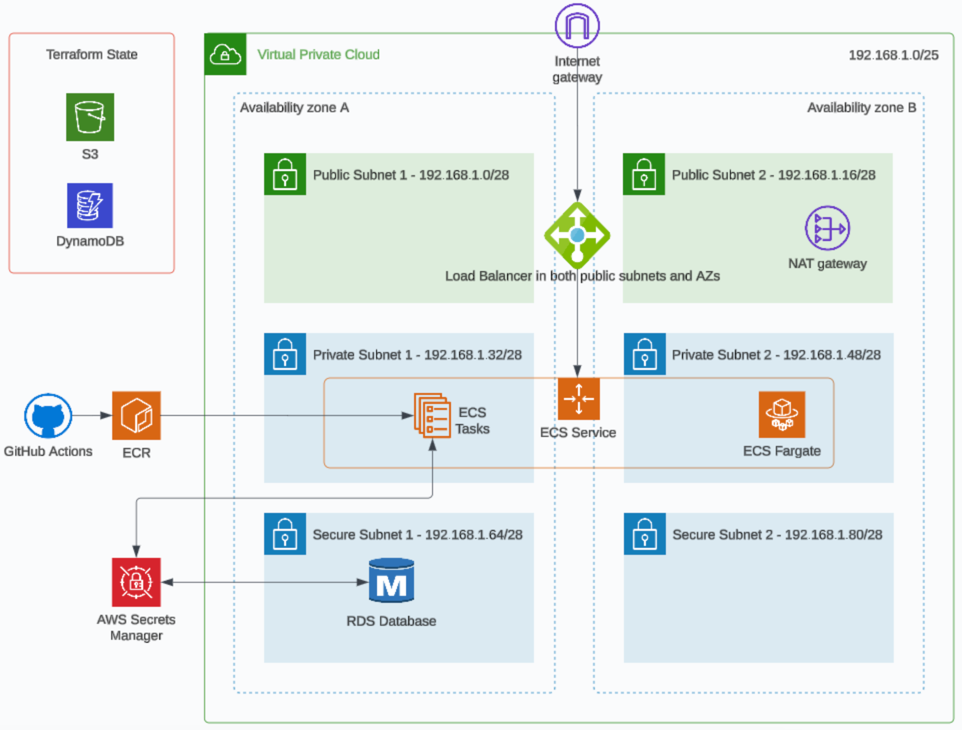

# Infra as Code - Lab Exercises

## Session 6 - Terraform Cloud and Pipelines

These lab exercises are to be completed in order, you will need to have completed the lab exercise for session 5 before proceeding.

### Overview

You will learn how to deploy using a CI/CD pipeline in GitHub Actions as well as learn how to deploy infrastructure using Terraform Cloud (SaaS) both using OIDC (OpenID Connect) authentication.


### Session 6 Goals

1. Deploy your Terraform code using GitHub Actions

2. Learn how to run tests against Terraform

3. How to deploy using Terraform Cloud

4. Learn more about 3rd Party cost optimisation tools from a FinOps (cloud cost management) perspective

5. Provide feedback on session 6

**Note:** I would like to stress that although it’s nice to complete all the lab goals it’s more important to learn and fully understand all the concepts and principles we are trying to teach you in each of these sessions.  If you are struggling for time then skip any optional goals and if you need help please reach out in the group chat.


### Architecture Diagram

Users connect to the application through a public facing load balancer which has a target of an ECS task container which resides in the private subnets spread across two AZs.  In this session we're adding a GitHub IAM Role which GitHub Actions assumes using OIDC to authenticate with AWS.  You'll create a GitHub Action to deploy and destroy the AWS infrastructure as well as another GitHub Acion to deploy the application to the ECS service.




### Pre-requisites, Deploy and Clean Up Instructions

Please read the root level [README](README.md) for instructions that are the same for every session on how to authenticate with AWS using the AWS CLI and how to run the Terraform commands to manage your infrastructure.

Hint: In the provider block, region variable or the `*.tfvars` file there is a value specified for the region, you should update this to match your AWS profile region.


### Difficulty Ratings

We're providing a relative scale of difficulty ratings from 1 to 10 for all the steps/goals in the lab exercises.  A rating of 1 is super easy and a rating of 10 is super hard.  This will hopefully help provide you with an understanding of what to expect before starting the steps/goals.


### Steps/Tasks for Goals 1 [Difficulty Rating: 8 (complex)]

These steps will allow you to deploy your Terraform code using GitHub Actions.  We recommend continuing to make small commits of your changes to your repo at logicial moments throughout the session.

1. Again we should manually create the db secret in the AWS Console (UI) if it doesn't already exist (see [Session 5 README](../Session_5_Terraform_Modules/README.md), goal 2, step 1 for more info).

2. Copy the `iam-github.tf` from this directory into your backend_support folder.  You'll need to add a new variable (repo_name) which is referenced in this file.  This varaible you should provide the default value of the name of your GitHub repository and include the owner (for example OWNER/REPOSITORY).  This GitHub IAM role is a new pre-requisite to enable you to use GitHub Actions with OIDC.  As we've now changed the purpose of this directory (backend_support), it's not just used for creating remote state management but also for creating the GitHub IAM role, we should rename it appropriately.  Please rename the backend_support folder to tf_prerequisites.

3. Log in to AWS, go to IAM and view 'identity providers' and if there is **NOT** an entry for 'token.actions.githubusercontent.com' then the code in `iam-github.tf` doesn't need to be changed, if it does exist then change the local variable on line 2 `gihub_oidc_already_exists` to `true`.  This will then create the OIDC provider which can only be created once per account.

4. I would like you to carefully review the permissions granted to the GitHub IAM role.  I've spent some time trying to make sure it is restricted to as close to least privilege principle.  This is done using a combination of managed policies like `arn:aws:iam::aws:policy/AmazonECS_FullAccess` as well as explicit permissions.  Whenever you create and assign IAM permissions you should be wary around using wildcards (*) and restrict it as much as possible to limit the blast radius if a security breach was to occur.

5. Now run the usual Terraform commands **in the tf_prerequisites folder** to create an IAM role for GitHub to authenticate with and use to create AWS resources on your behalf as well as create your backend support resources for state management.  Don't proceed to the next step until the Terraform deployment is successful.

6. Copy the GitHub Actions folders and files (.github/workflows/*) from the [demo repo](https://github.com/twlabs/infra-as-code-demo-examples/tree/main/.github/workflows) to the root of your solution therefore the root of your repo will now have a .github folder with a workflows folder inside and a deploy_infra.yaml file inside that.  The yaml file will provide the basic structure of your CI/CD pipeline but it will need extending.  Update the two env variables at the top of the yaml file for the region and IAM role to match your requirements and commit the code (to find out the ARN of your IAM GitHub role go to IAM in AWS, then roles and search for github, you should be able to identify your role and acquire the ARN).

7. Now if you access your GitHub repo in a web browser and navigate to the Actions tab you should see that a GitHub Action workflow exists called 'Deploy Infra' in the lefthand menu.  See if you can manually run your GitHub Action by clicking on 'Deploy Infra' and there should now be a 'Run workflow' button on the right hand side of the window, If you are working on a specific branch you need to pick `Use workflow from` and select your branch else use the default Branch:main and click on 'Run workflow'. It should succeed as all we are currently doing is authenticating to GitHub, it's not running any Terraform commands yet.  If you click into the deployment you will see the steps and output of the job which is useful when troubleshooting deployment issues.  Don't proceed to the next step until you have a successful GitHub Action (fix any errors and rerun the GitHub Action until it's green).

8. Before adding the plan and apply terraform stages to your GitHub Actions workflow to create your AWS resources you should set the ECS task definition back to X86_64 if you set it previously to ARM64 in Session 5 (example below).  If you didn't set it to ARM64 previously then you can skip this step.

```
  runtime_platform {
    cpu_architecture = "X86_64" # "ARM64" or "X86_64"
  }
``` 

If you build an image and try to run it in a different chipset then you will most likely see the following error in the container logs which is when you know you have a mismatch with the image and the runtime chipsets:

```
exec ./api: exec format error
```

9. We are now going to change our GitHub Action to run automatically on a commit.  In the deploy_infra.yaml file on line 3 change the string 'workflow_dispatch' to 'push' and commit your changes to see if the GitHub Action is now triggered on your commit.

10. Now add extra steps in your GitHub Action (deploy_infra.yaml) to install Terraform and then run Terraform init, plan and apply steps to deploy the resources to AWS (don't forget it will need to reference `dev.tfvars`).  Please take into consideration the deployment may take 10+ minutes.  Don't proceed to the next step until you have a successful GitHub Action for deploying your infrastructure.

11. As per this [slide](https://docs.google.com/presentation/d/1468DXJZPzhKKLAlxz6z7zhvYlkNLOaSCHztUYbQNKAI/edit#slide=id.g2c02383fe93_0_0) in the Session 6 slide deck, you can add additional build step options for formatting, linting, security, testing and documentation.  Experiment by adding formatting, linting and one other of these as pre or post deploy steps in your GitHub Action workflow.  If they are prebuild steps then ensure the deployment doesn't run if the prebuild steps fail.  You can run these commands locally first and first any issues they highlight before commiting changes to the repo therefore failing faster.

12. Now reverse the change in step 9 above.  In the deploy_infra.yaml change the word 'push' back to 'workflow_dispatch' on line 3 as we don't need the pipeline to run on every commit now.

13. Now we have the infrastructure deployed we need to deploy the basic crud app to ECS. Your application code would normally be in a separate repo but for this exercise we are simplifying it by using the same repo.  Copy the crud_app folder you used in the Session 5 lab exercise to the root of your repo.  Also copy deploy_to_ecs.yaml from this folder to your GitHub Actions workflow folder in your repo and update the env vars at the top of the yaml file to reflect the resources for your solution and commit these changes to your repo.

14. Now manually trigger the 'Deploy to ECS' GitHub Action to deploy your container image for the crud_app to ECS (it could take a few minutes to complete).  I recommend looking at the ECS service events and task logs if you need to troubleshoot the deployment, also the output of the GitHub action will also be helpful if you need to troubleshoot a failed deployment.

15. Assuming it is successful and your container is up and running then try and access your load balancer as you have done previously in Session 5's lab exercise (you can get the load balancer address from the output of the Terraform apply step in your GitHub Action Deploy Infra logs or via the AWS Console), e.g.

```
curl -X GET http://<load_balancer_dns_name>/users

curl -X POST http://<load_balancer_dns_name>/users -d '{"name":"John Doe", "email":"jdoe@example.com"}' -H "Content-Type: application/json"
```

This should return a json object with an Id along with the data passed in.  This indicates that the request worked and your solution has deployed successfully.

16. Once you have finished testing the solution you need to create a third GitHub Action yaml file for destroying the resources (e.g. destroy_infra.yaml which runs `terraform destroy -var-file="dev.tfvars" --auto-approve`).  Commit it to your repo and trigger it manually to destroy your infra resources.

These are the last changes you will make to this repo as part of this course but now you have a useful example repo to reference.  I do recommend looking through all the folders and files in this repo and ask yourself whether you are comfortable explaining what every files does, if so then you've hopefully learnt a lot through building this working solution.

17. Once the destroy GiHub Action has completed successfully you can safely destroy your remote state files too:

```
cd tf_prerequisites
terraform destroy --auto-approve
```

### Steps/Tasks for Goals 2 (Optional) [Difficulty Rating: 3 (easy)]

This is an optional easy exercise if you wish to learn more about how to run tests against Terraform code.  It uses the test framework which is built into the Terraform command line.

1. Copy the file ./tests/aws_resources.tftest.hcl into your `tf_prerequisites` folder in your repo.

2. Have a look at the structure of the file, it's running some test aseertions against the S3 bucket, the DynamoDB table and the IAM role which are resources that would be created using the code in this folder.

3. In a terminal navigate to your `tf_prerequisites` folder in your repo and run the following.

```
terraform init
terraform test
```

In theory you should see output similar to the following.

```
$ terraform test
aws_resources.tftest.hcl... in progress
  run "dynamoDb_tests"... pass
  run "iam_tests"... pass
aws_resources.tftest.hcl... tearing down
aws_resources.tftest.hcl... pass

Success! 2 passed, 0 failed.
```

If you don't see two passing tests see if you can correct the failing tests.

4. See if you can extend the test file and add a new test to make an assertion for the S3 bucket name.


### Steps/Tasks for Goals 3 (Optional) [Difficulty Rating: 6 (tricky)]

We have made this task optional as it provides a simple example of how to work with Terraform Cloud.  For this task we will create a new very basic solution to help us learn how to deploy terraform code using Terraform Cloud using OIDC for authentication.

1. Sign up to a free account [here](https://app.terraform.io/public/signup/account) using your Organisation email address.

2. Once logged into your Terraform account create an organisation.  After creating an organisation and before creating a workspace click on the 'Projects & workspaces' link in the breadcrumb links up the top of the screen.  Now click the 'New' button and create a new project giving it a name which is a string with no spaces in it.  Now click the 'New' button and select new workspace, choose a CLI-Driven workspace, give the workspace a name which is a string with no spaces in it and select the project you just created and click create.
   Please make a note of the names of the organisation, the project and the workspace.

3. Locally on your laptop create a new folder for this simple project.  Inside that folder create a folder called terraform_cloud_IAM_role and copy the files from the Demo repo for the [terraform_cloud_iam_role](https://github.com/twlabs/infra-as-code-demo-examples/tree/main/Session_6_Terraform_Cloud_and_Pipelines/terraform_cloud_IAM_role) into it.  Update the organisation, project and workspace variable defaults in `variables.tf` as applicable.

4. Log in to AWS and go to IAM and view 'identity providers' and if there is not an entry for `app.terraform.io` then the code in `iam-terraform-cloud.tf` doesn't need to be changed, if it does exist then change the local variable on line 2 `terraform_cloud_oidc_already_exists` to `true`.  Also in the same file update any permissions in the policy if you wish.  Now run the usual Terraform commands **in the terraform_cloud_iam_role folder** to create an IAM role for Terraform Cloud to authenticate with and use to create AWS resources on your behalf.

5. Navigate out of the terraform_cloud_iam_role folder back to the root folder for this new solution.  Create a file called `backend.tf` and add the following as contents changing the placeholders.

```
terraform {
  backend "remote" {
    organization = "<your_org_name>"

    workspaces {
      name = "<your_workspace_name>"
    }
  }
}
```

This file points the remote state for your solution to Terraform Cloud.

6. Add file `provider.tf` with the following content.

```
terraform {
  required_providers {
    aws = {
      source  = "hashicorp/aws"
      version = "5.40.0"
    }
  }
}

provider "aws" {
  region = var.region
}
```

7. Add file `s3.tf` (create a basic S3 bucket using the [S3_bucket](https://registry.terraform.io/providers/hashicorp/aws/latest/docs/resources/s3_bucket).


8. Add file `variables.tf` with these variables (update the region default value):

```
variable "region" {
  type        = string
  description = "Region to deploy the solution"
  default     = <placeholder:add_your_region>
}

variable "TFC_AWS_PROVIDER_AUTH" {
  description = "Terraform auth provider"
  type = bool
}

variable "TFC_AWS_RUN_ROLE_ARN" {
  description = "Terraform run arn"
  type = string
}
```

9. In the Terraform Cloud, navigate to your workspace and add the following workspace variables:

- TFC_AWS_PROVIDER_AUTH = true
- TFC_AWS_RUN_ROLE_ARN = "tw_iac_demo_terraform_cloud_role" (this should match the ARN used in `iam-terraform-cloud.tf` for the IAM role using your prefix, you can also search for the role in the AWS Console in IAM roles)

10. Run the following command and follow the instructions:

```
terraform login
```

11. Now run the usual Terraform commands to create an S3 bucket using Terraform Cloud (init, plan, apply).  In Terraform Cloud under your workspace you should see evidence that you've applied your terraform code to trigger a pipeline on their platform.  If you encounter any issues with authentication you can see their guide [here](https://developer.hashicorp.com/terraform/cloud-docs/workspaces/dynamic-provider-credentials/aws-configuration) on how to set OIDC authentication with AWS up which is what we've done initially with the code in the terraform_cloud_iam_role folder.

12. Having successfully deployed AWS resources using Terraform cloud we now need to destroy our resources which are no longer required, see commands below:

```
terraform destroy --auto-approve
cd terraform_cloud_IAM_role
terraform destroy --auto-approve
```


### Steps/Tasks for Goal 4 - FinOps [Difficulty Rating: 2 (easy)]

1. The first and primary objective of this goal is to destroy your resources once you have finished using them. Organisation can only fund this IaC course if cloud costs continue to be low therefore we need your help.  Please ensure you have completed the steps 16 and 17 in Goal 1 above to destroy your cloud resources.  If you were unable to destroy them using GitHub Actions you can run the following commands locally in the root of your repo that you've been using for all your session labs to destroy the AWS resources.

```
terraform destroy --auto-approve -var-file="dev.tfvars"
cd tf_prerequisites
terraform destroy --auto-approve
```

It also doesn't take long to double check by logging in to the AWS console to verify all the resources have been terminated which should give you satisfaction that no unnecessary cloud costs are accummulating.

2. The second step of this goal is to review the cost of the resources we created in the first goal of this lab exercise.  Like before we've worked out the costs using the [AWS Cost Calculator](https://calculator.aws/#/).  In this instance the costs are the same as before as we've not added any further resources.

| Resource / Service  | Quantity  |  Cost per Unit  | Cost per Year | Comments or extra info                        |
| ------------------- | --------- | --------------- | ------------- | --------------------------------------------- |
| VPC                 | 1         | 0.00            | 0.00          |                                               |
| Subnet              | 6         | 0.00            | 0.00          |                                               |
| Internet Gateway    | 1         | 0.00            | 0.00          |                                               |
| EIP                 | 1         | 3.65            | 43.80         |                                               |
| NAT Gateway         | 1         | 43.66           | 523.92        | 10 GB per month data processing               |
| Route Tables        | 2         | 0.00            | 0.00          |                                               |
| Data Transfer       | 1         | 3.42            | 41.04         | 30 GB per month outbound (guesstimate)        |
| DynamoDb (tf state) | 1         | 0.28            | 3.36          | 1 GB per month storage                        |
| S3 (tf state)       | 1         | 0.03            | 0.36          | 1 GB per month storage                        |
| ALB                 | 1         | 18.44           | 221.28        | 5 GB per month processing                     |
| ECR                 | 1         | 3.00            | 36.00         | 30 GB data stored                             |
| ECS                 | 1         | 43.22           | 518.64        | 1 x CPU, 2GB RAM                              |
| SecretsManager      | 1         | 0.40            | 4.80          | 4 x API calls per month                       |
| RDS                 | 1         | 45.41           | 544.92        | 1 x db.t3.small, 30 GB snapshot storage       |
| **Total**           | -         | **160.41**      | **1938.32**   |                                               |  

Note: Costs vary per region and will fluctuate due to AWS price changes and exchange rates, the prices above are for the Sydney region at the time of the README creation and are in USD.

3. It's worth being aware that there are many cloud agnostic 3rd party cost optimisation tools out there to help target FinOps to highlight areas where you can reduce cloud costs.  Many of them are SaaS platforms which you can grant permissions for them to be able to scan your cloud billing data and cloud resource usage to be able to provide cost saving recommendations.  Most of these platforms will be cloud agnostic which can be good if you run in a multi cloud architecture.  Here's a few of the main ones focusing on cost optimisation:

- [Apptio Cloudability](https://www.apptio.com/products/cloudability/)
- [CloudAdmin](https://www.cloudadmin.io/)
- [CloudCheckr](https://spot.io/product/cloudcheckr/)
- [DataDog](https://www.datadoghq.com/product/cloud-cost-management/)
- [Densify](https://www.densify.com/)
- [Flexera One](https://www.flexera.com/flexera-one)

As well as using an external company to help manage your cloud costs you can also create and run your own scripts to highlight cloud usage to help provide transparency on cloud costs.  A good example of this is the file `./scripts/query_aws_resources.sh` which you can run locally.  Using the AWS CLI this script will iterate through every region and display the numbers and details of specific resources.  It uses `jq` to be able to filter and manipulate the json output received from the AWS CLI commands.

We've covered quite a few principles and practices as well as tools and services which all can help towards reducing your cloud costs.  That said I still believe that it's fundamentally about cloud users following good cloud management practices.  For example without any accountability and ownership for the creation of cloud resources makes cloud management really difficult and can cause cloud costs to easily spiral out of control.  As an infrastructure engineer you can't ignore cloud costs, you should take ownership of any resources you create and try to optimse your solutions with cost in mind.


### Steps/Tasks for Goal 5 - Session Feedback [Difficulty Rating: 1 (easy)]

We can only make improvements if we receive feedback.  Please can you fill out this very short survey to help us understand what you liked or disliked and the learnings you've gained from this, thank you.