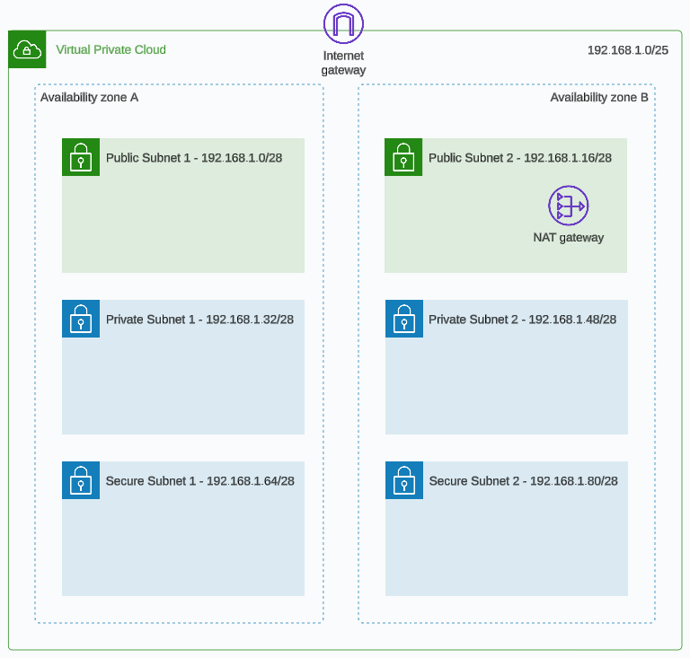
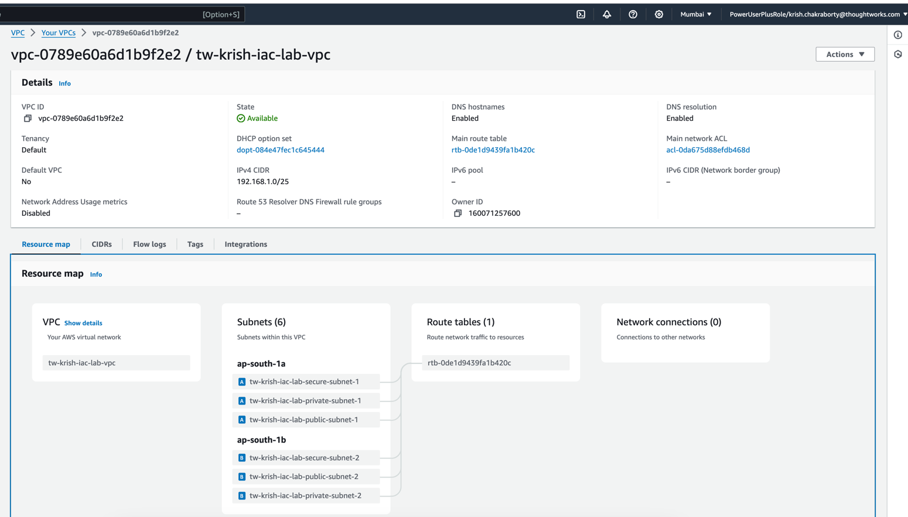
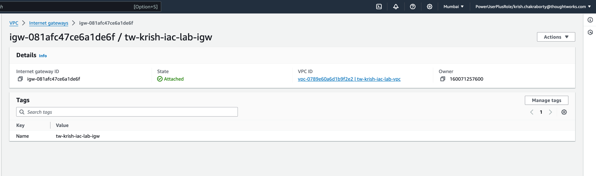
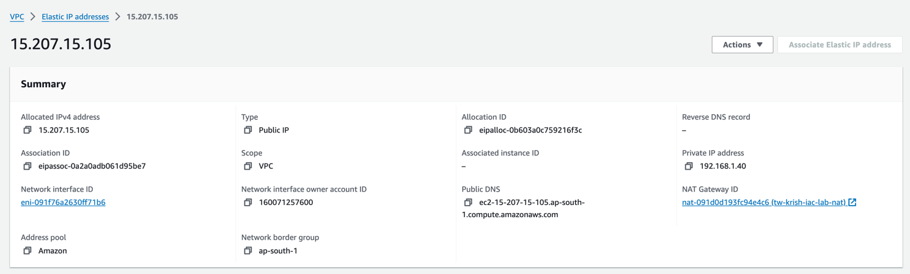
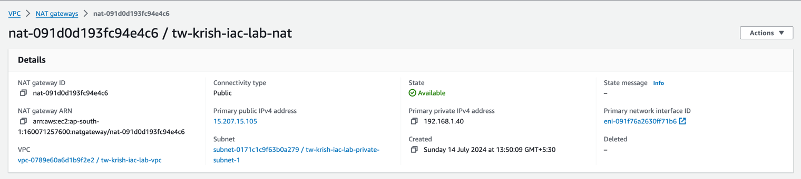

# Infra as Code - Lab Exercises

## Session 2 - Terraform Basics

These lab exercises are to be completed in order, you will need to have completed the lab exercise for session 1 before proceeding.

### Overview

You will learn how to create a fully functioning network in AWS that spans two availability zones in a single region.  Creating a network that spans two availability zones will allow you to architect a solution that can become highly available (e.g. if one AZ goes down then your solution can flip over to utilise the other AZ).  You should start off with the same code you have from session 1 and refactor it based on the exercises below.  You will also explore some of the cost related AWS services available to you.


### Session 2 Goals

1. Refactor our code from session 1 to be more scalable and easier to maintain.

2. Write and deploy Terraform code to create a fully functioning network that spans two availability zones in the same region.

3. Learn more about Cloud Billing, Consolidated Billing and AWS Cost Explorer from a FinOps (cloud cost management) perspective.

4. Provide feedback on session 2

**Note:** I would like to stress that although it’s nice to complete all the lab goals it’s more important to learn and fully understand all the concepts and principles we are trying to teach you in each of these sessions.  If you are struggling for time then skip any optional goals and if you need help please reach out in the group chat.


### Architecture Diagram

The network subnet design has been added in this session.



### Pre-requisites, Deploy and Clean Up Instructions

Please read the root level [README](../README.md) for instructions that are the same for every session on how to authenticate with AWS using the AWS CLI and how to run the Terraform commands to manage your infrastructure.

Hint: In the provider block, region variable or the `\*.tfvars` file there is a value specified for the region, you should update this to match your AWS profile region.

### Difficulty Ratings

We're providing a relative scale of difficulty ratings from 1 to 10 for all the steps/goals in the lab exercises.  A rating of 1 is super easy and a rating of 10 is super hard.  This will hopefully help provide you with an understanding of what to expect before starting the steps/goals.


### Steps/Tasks for Goals 1 and 2 [Difficulty Rating: 4 (medium)]

We will now run through the following steps to refactor your code to become easier to maintain as well as add a fully functioning network in AWS.  We recommend continuing to make small commits of your changes to your repo at logicial moments throughout the session.

1. Create a `variables.tf` file and add the following input variables in there, each having their own description. For examples of input variables see the [Terraform documentation](https://developer.hashicorp.com/terraform/language/values/variables).
    - prefix (type = string)
    - region (type = string)
    - vpc_cidr (type = string)
    - subnet1_cidr (type = string)
    - subnet2_cidr (type = string)
    - subnet3_cidr (type = string)
    - subnet4_cidr (type = string)
    - subnet5_cidr (type = string)
    - subnet6_cidr (type = string)

Example:

```
variable "vpc_cidr" {
  type        = string
  description = "VPC CIDR block"
}
```

Also, run `terraform fmt` to automatically format the code following Terraform standards.

2. Create a `dev.tfvars` file and add the following:

```
region = "<placeholder:add_your_aws_region>"
prefix = "<placeholder:add_your_name_or_initials>-iac-lab"
vpc_cidr     = "192.168.1.0/25"
subnet1_cidr = "192.168.1.0/28"
subnet2_cidr = "192.168.1.16/28"
subnet3_cidr = "192.168.1.32/28"
subnet4_cidr = "192.168.1.48/28"
subnet5_cidr = "192.168.1.64/28"
subnet6_cidr = "192.168.1.80/28"
```

3. Add a file `provider.tf` and move the Terraform and provider blocks from `main.tf` into this file. Also instead of having a hard coded value for your region in the provider block use `var.region`. In `main.tf` you also wish to remove the hard coded entries, e.g. add in `var.vpc_cidr` for the `cidr_block` and include `var.prefix` in your tag name for the VPC so that it reads '<prefix>-vpc', for example `format("%s-vpc", var.prefix)` or `"${var.prefix}-vpc"`.

4. Follow the prerequisites to authenticate to AWS via the command line, see root level [README](../README.md).

5. Test your changes by running the following commands to see if you can deploy your VPC:

```
terraform init
terraform plan -var-file="dev.tfvars"
terraform apply -var-file="dev.tfvars"
```

Troubleshoot any errors before proceeding.

6. We now wish to create some subnets inside our VPC (think of this like splitting up your larger VPC network into smaller networks which helps to isolate network traffic for ease of management and improved security). We will need to create 6 subnets, two public, two private and two secure. What makes these subnets public, private or secure is based on the routing associated with the subnets. For example public subnets will have a direct route to the internet (load balancers are good examples of resources that you would have in these subnets). Private subnets will have to route internet traffic via an appliance or service (NAT Gateway) which forwards the request (EC2 instances or ECS containers are good examples of resources that you would have in these subnets). Secure subnets do not have any internet access at all (PaaS services like RDS are good examples of resources that you would have in these subnets). The reason we have two of each subnet type is because we are creating one of each in one availability zone (AZ) and one of each in another AZ therefore enabling us to create a multi-AZ solution.

We should recognise that having a file called `main.tf` is not helpful as it doesn't provide any indication what the purpose of the file is so let's start by renaming `main.tf` to `network.tf` and add 6 x [subnet resources](https://registry.terraform.io/providers/hashicorp/aws/latest/docs/resources/subnet) into this file.

- You will notice that you can't have the same resource called the same name, e.g. main. You should name the resources appropriate to their purpose.
- You will need to add the `var.subnet\*\_cidr` variable for each of the subnet cidr_blocks
- Also add `Name` tags using `var.prefix` and the type of resource it is to identify them e.g. `format("%s-public-subnet-1", var.prefix)`
- Ensure that you use the `availability_zone` attribute to ensure that there are 3 subnets (public, private and secure) in one AZ and 3 subnets (public, private and secure) in a different AZ within your region.

7. Test your changes by running the following commands to see if you can deploy your VPC and it's subnets:

```
terraform plan -var-file="dev.tfvars"
terraform apply -var-file="dev.tfvars"
```

Troubleshoot any errors before proceeding, it is also worth logging into the AWS Console to have a look at your VPC and subnets to see if they look ok, correct tags and CIDR blocks, etc.




8. We are about to add more Terraform resources which will have relationships with other Terraform resources. This is where it is important to name your resources appropriately. In the Terraform documentation many of the resources will be called example or main, you should use common sense in naming them something related to their purpose. Add the following resources into the network.tf file:

    - 1 x [internet gateway](https://registry.terraform.io/providers/hashicorp/aws/latest/docs/resources/internet_gateway), apply a suitable tag name.
    - 1 x [Elastic IP](https://registry.terraform.io/providers/hashicorp/aws/latest/docs/resources/eip) which is for the NAT Gateway. It should only have the domain attribute.
    - 1 x [NAT Gateway](https://registry.terraform.io/providers/hashicorp/aws/latest/docs/resources/nat_gateway), associate it with the Elastic IP above as well as one of your private subnets and apply a suitable tag name.

9. Test your changes by running the following commands to see if you can deploy all your resources:

```
terraform plan -var-file="dev.tfvars"
terraform apply -var-file="dev.tfvars"
```

Troubleshoot any errors before proceeding.








10. Now we will add the route tables and associate them with the subnets. We will create a public route table which will have a route to the internet (`0.0.0.0`) via the internet gateway resource. We will also create a private route table which will have a route to the internet (`0.0.0.0`) via the NAT gateway resource. We will then associate the public subnet resources with the public route table and the private subnet resources with the private route table.

In network.tf add 2 x [Route Table](https://registry.terraform.io/providers/hashicorp/aws/latest/docs/resources/route_table) resources, one for public routing and one for private routing (each route table should only have a single route for `0.0.0.0/0`).

Now add 4 x [Route Table Association](https://registry.terraform.io/providers/hashicorp/aws/latest/docs/resources/route_table_association) resources, create an association between a route table and a subnet from the Terraform registry using the hyperlink provided, associate the public subnets with the public route table and the private subnets with the private route table (this is not very [DRY](https://en.wikipedia.org/wiki/Don%27t_repeat_yourself) but we will make improvements here in later sessions).

11. Test your changes by running the following commands to see if you can deploy all your resources:

```
terraform plan -var-file="dev.tfvars"
terraform apply -var-file="dev.tfvars"
```

Troubleshoot any errors before proceeding.


12. Lastly we would like to get an output varaible of the VPC Id. Create an `outputs.tf` file and add an [output variable](https://developer.hashicorp.com/terraform/language/values/outputs) for this (don't forget to add a description attribute).

13. Run the following commands to test deploying your updated network resources:

```
terraform init
terraform plan -var-file="dev.tfvars"
terraform apply -var-file="dev.tfvars"
```

Troubelshoot any errors and have a look in the AWS Console to ensure your VPC and networking resoures look ok, correct tags, routes, associations, etc.

14. Commit your working code to your repo.

### Steps/Tasks for Goal 3 - FinOps [Difficulty Rating: 2 (easy)]

1. The first and primary objective of this goal is to destroy your resources once you have finished using them. Organisation can only fund this IaC course if cloud costs continue to be low therefore we need your help. Please ensure you have run the following to destroy your cloud resources.

```
terraform destroy --auto-approve -var-file="dev.tfvars"
```

It also doesn't take long to double check by logging in to the AWS console to verify all the resources have been terminated which should give you satisfaction that no unnecessary cloud costs are accummulating.

2. The second step of this goal is to review the cost of the resources we created in this lab exercise. To work out costs for AWS resources I'm using the [AWS Cost Calculator](https://calculator.aws/#/) which allows you to look up and calculate pricing for all your resources before using them. Below I've itemised what AWS resources we have created and the cost for them so far. Notice we are now being charged.

| Resource / Service  | Quantity  |  Cost per Unit  | Cost per Year | Comments or extra info                        |
| ------------------- | --------- | --------------- | ------------- | --------------------------------------------- |
| VPC                 | 1         | 0.00            | 0.00          |                                               |
| Subnet              | 6         | 0.00            | 0.00          |                                               |
| Internet Gateway    | 1         | 0.00            | 0.00          |                                               |
| EIP                 | 1         | 3.65            | 43.80         |                                               |
| NAT Gateway         | 1         | 43.66           | 523.92        | 10 GB per month data processing               |
| Route Tables        | 2         | 0.00            | 0.00          |                                               |
| Data Transfer       | 1         | 3.42            | 41.04         | 30 GB per month outbound (guesstimate)        |
| **Total**           | -         | **50.73**       | **608.76**    |                                               | 

Note: Costs vary per region and will fluctuate due to AWS price changes and exchange rates, the prices above are for the Sydney region at the time of the README creation and are in USD.

3. AWS sends monthly invoices to their clients as [PDF documents](https://docs.aws.amazon.com/awsaccountbilling/latest/aboutv2/getting-viewing-bill.html) but the billing data can also be accessed through the [billing and cost management dashboard](https://docs.aws.amazon.com/awsaccountbilling/latest/aboutv2/view-billing-dashboard.html) in the AWS Console (UI). By default users don't have access to the billing data in the AWS accounts, it has to be [activated](https://docs.aws.amazon.com/IAM/latest/UserGuide/tutorial_billing.html) first. Once activated you can use [Cost Explorer](https://aws.amazon.com/aws-cost-management/aws-cost-explorer/) to filter your billing data by region, service, tag, etc to help visualise your cloud costs over any specified date range. You can also configure cost budgets and email alerts when your cloud costs go over a specified threshold which you can set. This may help to warn you when your overall costs are increasing.

If you wished to look at the raw billing data you can access the S3 bucket which stores this information in CSV format. You can also configure AWS to create [Cost and Usage Reports](https://docs.aws.amazon.com/cur/latest/userguide/what-is-cur.html) which store up to date information in an S3 bucket also in CSV format relating to your cloud costs.

- root/management
- security
- shared
- audit
- workload: dev
- workload: test
- workload: prod

With this set up receiving a bill for each account is not efficient. This is why AWS provide [Consolidated Billing](https://docs.aws.amazon.com/awsaccountbilling/latest/aboutv2/consolidated-billing.html). You can create a root/management account that associates all the other AWS accounts as child accounts in part of an AWS Organisation. Cloud costs for all accounts will be included into a single bill making it easier to manage. In the next session we will look at other advantages of AWS Organisations for cost management.

### Steps/Tasks for Goal 4 - Session Feedback [Difficulty Rating: 1 (easy)]

We can only make improvements if we receive feedback. Please can you fill out this very short survey to help us understand what you liked or disliked and the learnings you've gained from this, thank you.