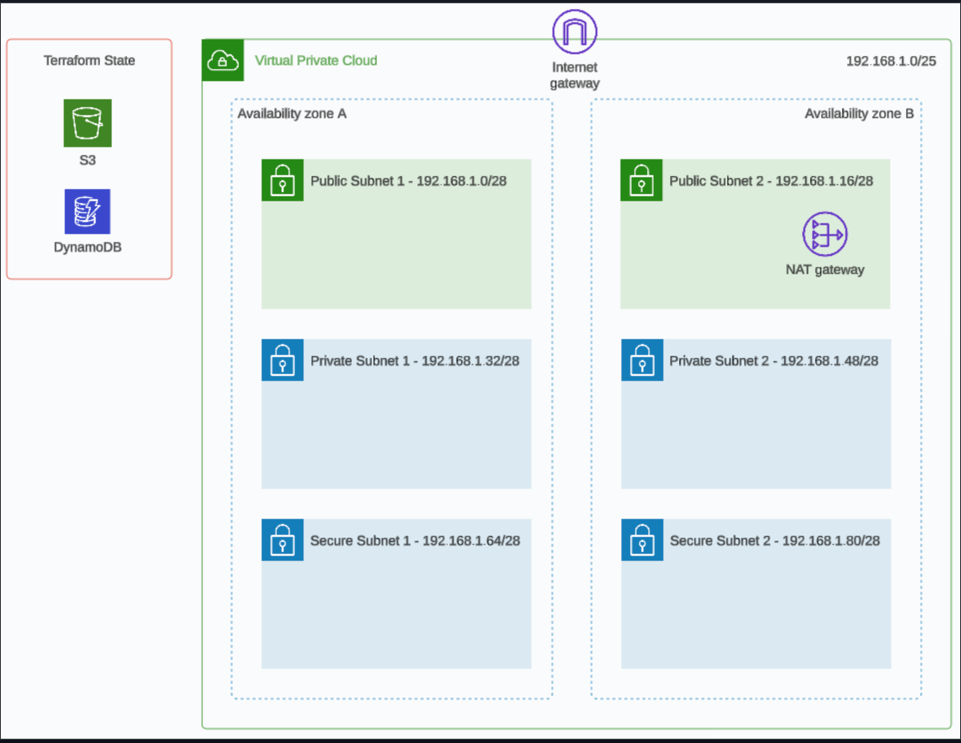

# Infra as Code - Lab Exercises

## Session 3 Terraform State

These lab exercises are to be completed in order, you will need to have completed the lab exercise for session 2 before proceeding.

### Overview

You will learn how to set up remote state management for your Terraform code base as well as learn about importing, moving and removing resources from your Terraform state.  You will also learn about how AWS Service Control Policies can help with cloud cost management.


### Session 3 Goals

1. Refactor our code from session 2 to use remote state management.

2. Add an extra resource in AWS using the AWS Console then import the resource into your Terraform code, move the resource using the Terraform move block and then finally remove the resource from your Terraform code without destroying it in AWS.

3. Learn more about AWS Service Control Policies (SCPs) from a FinOps (cloud cost management) perspective.

4. Provide feedback on session 3

**Note:** I would like to stress that although it’s nice to complete all the lab goals it’s more important to learn and fully understand all the concepts and principles we are trying to teach you in each of these sessions.  If you are struggling for time then skip any optional goals and if you need help please reach out in the group chat.


### Architecture Diagram

The network design has been accompanied by the remote state management using S3 and DynamodDB in this session.




### Pre-requisites, Deploy and Clean Up Instructions

Please read the root level [README](../README.md) for instructions that are the same for every session on how to authenticate with AWS using the AWS CLI and how to run the Terraform commands to manage your infrastructure.

Hint: In the provider block, region variable or the `*.tfvars` file there is a value specified for the region, you should update this to match your AWS profile region.


### Difficulty Ratings

We're providing a relative scale of difficulty ratings from 1 to 10 for all the steps/goals in the lab exercises.  A rating of 1 is super easy and a rating of 10 is super hard.  This will hopefully help provide you with an understanding of what to expect before starting the steps/goals.


### Steps/Tasks for Goal 1 [Difficulty Rating: 4 (medium)]

We are creating an independent folder inside your project that has Terraform files to create the resources necessary for remote state management.  We will run Terraform in this folder to create these resources before running Terraform in the root folder of your project to create the resources for your solution.  We recommend continuing to make small commits of your changes to your repo at logicial moments throughout the session.

1. Create a backend_support folder at the root of your solution, this will store the code for the resources necessary for remote state management.

2. In this folder create `s3.tf` and add in the following resources:
    - 1 x [S3 Bucket](https://registry.terraform.io/providers/hashicorp/aws/latest/docs/resources/s3_bucket), provide a suitable name for the Terraform resource and name the S3 bucket `${var.prefix}-tfstate`, also add a force_destroy attribute which has a value of true to your bucket (you wouldn't normally wish to do this for your tfstate but as we are running Terraform destroy regularly because this is a temporary solution it makes sense).
    - You need to also add three other related S3 resources (find these resources in the online Terraform Registry and then add them into your code) that will enable you to do the following:
        - Enable bucket versioning for the S3 bucket
        - Ensure that the S3 bucket is using encryption algorithm AES256
        - Ensure that all public access is blocked

3. Copy `dynamodb.tf` from this directory across to your backend_support folder.

4. Copy your `providers.tf` form the root of your solution into this directory.

5. You will also need to create `variables.tf` in this directory and add variables for prefix and region with default values that make common sense.

6. Follow the prerequisites to authenticate to AWS via the command line, see root level [README](../README.md).

7. Navigate to the backend_support folder and run and test out the following commands to deploy your remote state management resources:

```
cd backend_support
terraform init
terraform plan
terraform apply
```

Troubleshoot any errors before proceeding, it is also worth logging into the AWS Console to have a look at your S3 bucket and DynamodDB table.  Notice the Terraform state for this folder is local whereas the Terraform state for your root folder will be remote.

8. Now we want to use the remote state management resources we created.  Create `backend.tf` in the root of your solution with the following code (update the placeholders as appropriate, also note that you can't use variables in this file, unfortunately it needs to be hard coded):

```
terraform {
  backend "s3" {
    bucket = "<placeholder:S3_bucket_name>"
    key    = "<placeholder:S3_key_/_file_path_to_state_file>"
    region = "<placeholder:add_your_aws_region>"

    dynamodb_table = "<placeholder:dynamodb_table>"
    encrypt        = true
  }
}
```

9. Before we test out the remote state we should remove the local Terraform state files to ensure there are no conflicts.  Before doing so we should run `terraform state list` on the command prompt at the root of your solution.  It should return nothing which highlights Terraform is not managing any resources and therefore safe to delete the local Terraform state files.  If it does list some resources then you should run `terraform destroy -var-file="dev.tfvars"` to remove them before proceeding.  Assuming you now have no resources listed when you run 'terraform state list' you can now delete the following files in the root of your solution.

```
terraform.tfstate
terraform.tfstate.backup
```

8. Now you can run the following commands to test deploying your resources with the new remote state:

```
terraform init
terraform plan -var-file="dev.tfvars"
terraform apply -var-file="dev.tfvars"
```

Troubleshoot any errors before proceeding.

I have seen some engineers create the Terraform state resources using a Cloudformation template too.  It is down to personal preference how you choose to create and manage the Terraform remote state resources.

9. Commit your working code to your repo.


### Steps/Tasks for Goal 2 (Optional) [Difficulty Rating: 3 (easy)]

This specific goal gives you the awareness of a few more important Terraform commands (Terraform import, move and remove).  It is optional because it will not impact the creation and functionality of the final solution.

We are going to add an extra resource in AWS using the AWS Console then import the resource into your Terraform code, move the resource using the Terraform move block and then finally remove the resource from your Terraform code without destroying it in AWS.

1. Add a new subnet with CIDR block `192.168.1.96/28` into your VPC using the AWS Console (UI).

2. Using the [import block](https://developer.hashicorp.com/terraform/language/import) try to import the resource into your solution in the `network.tf` file. Not just the import block alone is needed pl understand the syntax from the given reference. Once you've updated `network.tf` run the Terraform plan command which should recognise there is one resource to be imported.  If so then run the Terraform apply command to bring the new subnet into your Terraform state and solution.  Once you've run the apply command successfully you can safely remove the import block.

3. Using the [move block](https://developer.hashicorp.com/terraform/language/modules/develop/refactoring#moved-block-syntax) try to rename the resource in your solution with a new name.  This can be useful if you are refactoring your solution and moving resources into modules which we'll come on to later.

4. Using the [Terraform rm cmd](https://developer.hashicorp.com/terraform/cli/commands/state/rm) remove the resource you imported earlier.  You should also remove the related code from `network.tf` otherwise your solution will try to recreate it the next time it runs.  Once removed you can run terraform state list to confirm it's no longer managed by Terraform and you can also login to the AWS Console (UI) to confirm the resource still exists.


5. Delete the subnet you create in step 1 manually using the AWS Console (UI).


### Steps/Tasks for Goal 3 - FinOps [Difficulty Rating: 2 (easy)]

1. The first and primary objective of this goal is to destroy your resources once you have finished using them. Organisation can only fund this IaC course if cloud costs continue to be low therefore we need your help.  Please ensure you have run the following to destroy your cloud resources.

```
terraform destroy --auto-approve -var-file="dev.tfvars"
cd backend_support
terraform destroy --auto-approve
```

It also doesn't take long to double check by logging in to the AWS console to verify all the resources have been terminated which should give you satisfaction that no unnecessary cloud costs are accummulating.

2. The second step of this goal is to review the cost of the resources we created in this lab exercise.  To work out costs for AWS resources I'm using the [AWS Cost Calculator](https://calculator.aws/#/) which allows you to look up pricing for resources before using them.  Below I've itemised what AWS resources we have created and the cost for them so far.  As we haven't really added any extra resources the costs are the same as before.

| Resource / Service  | Quantity  |  Cost per Unit  | Cost per Year | Comments or extra info                        |
| ------------------- | --------- | --------------- | ------------- | --------------------------------------------- |
| VPC                 | 1         | 0.00            | 0.00          |                                               |
| Subnet              | 6         | 0.00            | 0.00          |                                               |
| Internet Gateway    | 1         | 0.00            | 0.00          |                                               |
| EIP                 | 1         | 3.65            | 43.80         |                                               |
| NAT Gateway         | 1         | 43.66           | 523.92        | 10 GB per month data processing               |
| Route Tables        | 2         | 0.00            | 0.00          |                                               |
| Data Transfer       | 1         | 3.42            | 41.04         | 30 GB per month outbound (guesstimate)        |
| DynamoDb (tf state) | 1         | 0.28            | 3.36          | 1 GB per month storage                        |
| S3 (tf state)       | 1         | 0.03            | 0.36          | 1 GB per month storage                        |
| **Total**           | -         | **51.04**       | **612.48**    |                                               | 

Note: Costs vary per region and will fluctuate due to AWS price changes and exchange rates, the prices above are for the Sydney region at the time of the README creation and are in USD.

3. In the last session's FinOps knowledge share we discussed what AWS organisations are and why you should split out your AWS accounts into a structure similar to the following to adhere to best preactices:

- root/management
- security
- shared
- audit
- workload: dev
- workload: test
- workload: prod

If one of these accounts gets compromised then this limits the blast radius.  There are also other security and cost benefits from doing this.  In AWS Organisations you can group your AWS accounts together into logical groups called organisational units.  For example, we may create the following three AWS organisational units for the example above:

- root
    - management
        - root/management
        - security
        - shared
        - audit
    - non-prod
        - workload: dev
        - workload: test
    - prod
        - workload: prod

This allows us to apply rules known as Service Control Policies (SCPs) at these group levels.  For example we may create an SCP at the top root level to restrict anyone from running any resourcs outside of the eu-central-1 and eu-west-1 regions.

```
{
    "Version": "2012-10-17",
    "Statement": [
        {
            "Sid": "DenyAllOutsideEU",
            "Effect": "Deny",
            "NotAction": [
                "a4b:*",
                "acm:*",
                "aws-marketplace-management:*",
                "aws-marketplace:*",
                "aws-portal:*",
                "budgets:*",
                "ce:*",
                "chime:*",
                "cloudfront:*",
                "config:*",
                "cur:*",
                "directconnect:*",
                "ec2:DescribeRegions",
                "ec2:DescribeTransitGateways",
                "ec2:DescribeVpnGateways",
                "fms:*",
                "globalaccelerator:*",
                "health:*",
                "iam:*",
                "importexport:*",
                "kms:*",
                "mobileanalytics:*",
                "networkmanager:*",
                "organizations:*",
                "pricing:*",
                "route53:*",
                "route53domains:*",
                "route53-recovery-cluster:*",
                "route53-recovery-control-config:*",
                "route53-recovery-readiness:*",
                "s3:GetAccountPublic*",
                "s3:ListAllMyBuckets",
                "s3:ListMultiRegionAccessPoints",
                "s3:PutAccountPublic*",
                "shield:*",
                "sts:*",
                "support:*",
                "trustedadvisor:*",
                "waf-regional:*",
                "waf:*",
                "wafv2:*",
                "wellarchitected:*"
            ],
            "Resource": "*",
            "Condition": {
                "StringNotEquals": {
                    "aws:RequestedRegion": [
                        "eu-central-1",
                        "eu-west-1"
                    ]
                },
                "ArnNotLike": {
                    "aws:PrincipalARN": [
                        "arn:aws:iam::*:role/Role1AllowedToBypassThisSCP",
                        "arn:aws:iam::*:role/Role2AllowedToBypassThisSCP"
                    ]
                }
            }
        }
    ]
}
```

The above SCP affects all child accounts where it is applied, therefore in this example it affects every single AWS account in the organisation.  This helps from both a security and cost perspective as it restricts the creation of unexpected resources in unauthorised regions.

You may also apply an SCP at an organisational unit level, in the non-prod organisational unit we can restrict users from creating and running large EC2 instance types:

```
{
  "Version": "2012-10-17",
  "Statement": [
    {
      "Sid": "RequireMicroInstanceType",
      "Effect": "Deny",
      "Action": "ec2:RunInstances",
      "Resource": [
        "arn:aws:ec2:*:*:instance/*"
      ],
      "Condition": {
        "StringNotEquals": {
          "ec2:InstanceType": "t2.micro"
        }
      }
    }
  ]
}
```

This is an example of how to enforce cost limiting controls across specific AWS accounts.

For more examples on Service Control Policies (SCPs) have a look [here](https://docs.aws.amazon.com/organizations/latest/userguide/orgs_manage_policies_scps_examples.html).


### Steps/Tasks for Goal 4 - Session Feedback [Difficulty Rating: 1 (easy)]

We can only make improvements if we receive feedback. Please can you fill out this very short survey to help us understand what you liked or disliked and the learnings you've gained from this, thank you.