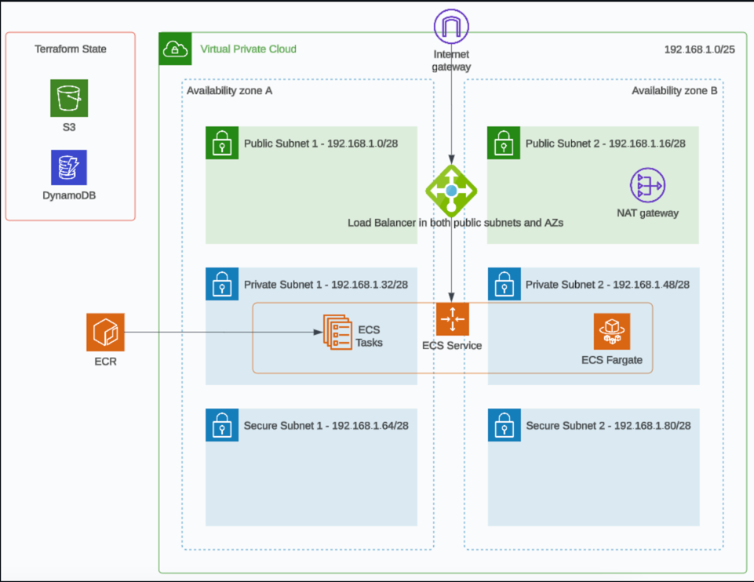

# Infra as Code - Lab Exercises

## Session 4 - Terraform Tips n Tricks

These lab exercises are to be completed in order, you will need to have completed the lab exercise for session 3 before proceeding.

### Overview

You will learn how to implement Terraform meta-arguments and functions which help to clean up our code from a [DRY](https://en.wikipedia.org/wiki/Don%27t_repeat_yourself) perspective.  We will also implement AWS ECS Fargate with a public facing application load balancer (ALB).


### Session 4 Goals

1. Refactor to make improvements using meta-aguments and functions.

2. Add an ALB, Elastic Container Registry (ECR) and an ECS Cluster, service and task to your AWS solution using Terraform.

3. Learn more about AWS Tags from a FinOps (cloud cost management) perspective.

4. Provide feedback on session 4

**Note:** I would like to stress that although it’s nice to complete all the lab goals it’s more important to learn and fully understand all the concepts and principles we are trying to teach you in each of these sessions.  If you are struggling for time then skip any optional goals and if you need help please reach out in the group chat.


### Architecture Diagram

Users connect to the application through a public facing application load balancer which has a target of an ECS task container which resides in the private subnets spread across two AZs.  In this session we're adding the load balancer and the ECS cluster as well as an ECR.




### Pre-requisites, Deploy and Clean Up Instructions

Please read the root level [README](../README.md) for instructions that are the same for every session on how to authenticate with AWS using the AWS CLI and how to run the Terraform commands to manage your infrastructure.

Hint: In the provider block, region variable or the `*.tfvars` file there is a value specified for the region, you should update this to match your AWS profile region.


### Difficulty Ratings

We're providing a relative scale of difficulty ratings from 1 to 10 for all the steps/goals in the lab exercises.  A rating of 1 is super easy and a rating of 10 is super hard.  This will hopefully help provide you with an understanding of what to expect before starting the steps/goals.


### Steps/Tasks for Goal 1 [Difficulty Rating: 6 (tricky)]

We are refactoring to include the usage of meta-aguments and functions as well as adding default tags.  We recommend continuing to make small commits of your changes to your repo at logicial moments throughout the session.

1. The file `networking.tf` doesn't currently follow the [DRY](https://en.wikipedia.org/wiki/Don%27t_repeat_yourself) principle.  You can see multiple resources repeated like subnets.  Refactor the subnets so you don't have 6 Terraform subnet resources, you may have 3 (public, private and secure) or perhaps less (you may need to use count, for or for_each loops).  I would like you to use the [cidrsubnet](https://developer.hashicorp.com/terraform/language/functions/cidrsubnet) function as part of the refactoring exercise.  Therefore this will impact your variables and entries in tfvars as you no longer need to provide variables for every single subnet CIDR block as it can be calculated using this function.  Below I've shown the output of using Terraform console to test the cidrsubnet function with your VPC CIDR block without running any code, this should help with your refactoring.  Feel free to test out using Terraform Console yourself.

```
% terraform console
> cidrsubnet("192.168.1.0/25",3,1)
"192.168.1.16/28"
> cidrsubnet("192.168.1.0/25",3,2)
"192.168.1.32/28"
> cidrsubnet("192.168.1.0/25",3,3)
"192.168.1.48/28"
> cidrsubnet("192.168.1.0/25",3,4)
"192.168.1.64/28"
> cidrsubnet("192.168.1.0/25",3,5)
"192.168.1.80/28"
> cidrsubnet("192.168.1.0/25",3,6)
"192.168.1.96/28"
>  
```

With my solution which you don't have to follow, I added the following variables:

```
number_of_public_subnets  = 2
number_of_private_subnets = 2
number_of_secure_subnets  = 2
```

You should also be able to reduce the number of aws_route_table_association resources from 4 down to 2 using count, for or for_each loops.  You will still create exactly the same amount of resources but the code will be cleaner.

Here's another hint, to resolve the subnet availability zone allocation you could use the [data aws_availability_zones](https://registry.terraform.io/providers/hashicorp/aws/latest/docs/data-sources/availability_zones) resource to get a list of all the AZs in your region:

```
data "aws_availability_zones" "available" {}
```

Then use count in your subnet resource to dictate which AZ the subnet resides in.

```
availability_zone = data.aws_availability_zones.available.names[count.index]
```

There are likely to be many ways to reduce the duplication of resources and clean up the code so it's up to you how you wish to achieve this.

2. Also add the following default_tags in the provider block in `provider.tf` in the root of your solution.  This will ensure that all taggable resources inheirt these tags throughout your solution:
    - ManagedBy = "Terraform"
    - Project = var.prefix
    - Environment = "Dev"

3. Add a lifecycle attribute to your remote state S3 bucket with `prevent_destroy` value equals true.  This is good practice if you want to ensure that another process cannot destroy your resource.

4. Once you've finished refactoring then test out the changes and see if it deploys:

```
cd backend_support
terraform init
terraform apply -auto-approve
cd ..
terraform init
terraform plan -var-file="dev.tfvars"
terraform apply -var-file="dev.tfvars"
```

Troubleshoot any errors before proceeding.

5. Commit your working code to your repo.


### Steps/Tasks for Goal 2 [Difficulty Rating: 6 (tricky)]

We are adding an Application Load Balancer (ALB), ECR and an ECS Cluster, service and task to your AWS solution through your Terraform code.  We recommend continuing to make small commits of your changes to your repo at logicial moments throughout the session.

1. Create `ecr.tf` in the root of your solution and add an [Elastic Container Registry (ECR)](https://registry.terraform.io/providers/hashicorp/aws/latest/docs/resources/ecr_repository) resource with a friendly identifying tag name that utilises var.prefix similar to the other resources you've tagged and also maintain image_scanning_configuration block in the aws_ecr_repository resource.  Name this Terraform resource 'api' (this is the name it's referenced by in `ecs.tf`) and provide the ECR a name attribute that equals "${var.prefix}-crud-app".  Also add a force_delete attribute which has a value of true to your ECR.  The ECR is used to store your container images.

2. Copy `ecs.tf` and `iam-ecs.tf` from this directory into your root folder.  This will create an ECS cluster and assign IAM permissions to the ECS task which runs under the ECS service.  Have a look at the code in these two new files so you understand what resources are being created.  The ECS task is the container you will be running.

3. Create a directory templates at the root of your solution and copy container.json into it.  This is your container definition.  You should be able to see that this template file has placeholders for variables that will be passed in via the Terraform ECS task resource.

4. Create `lb.tf` with the following ALB related resources and set their attributes as specified below. Notice that, in Terraform resources, an application load balancer (alb) is named simply `aws_lb`. The `aws_lb` defaults to being an application load balancer when not specified otherwise. It will create one application load balancer with an associated listener and security group.  It will also create an IP based target group linked to the load balancer which is referenced by the ECS Service in `ecs.tf` (aws_lb_target_group.this.arn).
    - [aws_lb](https://registry.terraform.io/providers/hashicorp/aws/latest/docs/resources/lb)
        - call this Terraform resource 'lb' (this is the name it's referenced by in `ecs.tf`)
        - load_balancer_type = application
        - internal = false
        - security_groups = the Id of the security group created in this file (`lb.tf`)
        - subnets = a list of all the public subnet Ids
        - name the resource appropriately, e.g. var.prefix-lb
        - Add a Name tag that utilises the prefix, e.g. var.prefix-lb
    - [aws_lb_target_group](https://registry.terraform.io/providers/hashicorp/aws/latest/docs/resources/lb_target_group)
        - call this Terraform resource 'tg' (this is the name it's referenced by in `ecs.tf`)
        - port = 8000
        - protocol = "HTTP"
        - vpc_id = the Id of the VPC
        - target_type = "ip"
        - health_check = copy the content from target_group_health_check.txt in this folder and add it as the health_check attribute
        - name the resource appropriately, e.g. var.prefix-tg
    - [aws_lb_listener](https://registry.terraform.io/providers/hashicorp/aws/latest/docs/resources/lb_listener)
        - port = 80
        - protocol = "HTTP"
        - load_balancer_arn = aws_lb.lb.arn
        - default_action = forward to the target group created in this file (`lb.tf`)
    - [aws_security_group](https://registry.terraform.io/providers/hashicorp/aws/latest/docs/resources/security_group)
        - call this Terraform resource 'lb_sg' (this is the name it's referenced by in `ecs.tf`)
        - vpc_id = the Id of the VPC
        - description = add a suitable description
        - 1 x ingress rule attribute, protocol = tcp, from and to port is 80, from source 0.0.0.0/0 (using the cidr_blocks attribute).  This allows anyone externally to reach the load balancer on the web port.
        - 1 x ingress rule attribute, protocol = tcp, from and to port is 8000, from source 'itself' (self = true).
        - 1 x egress rule attribute, protocol = -1, from and to port is 0, to destination 0.0.0.0/0 (using the cidr_blocks attribute).  This allows all outbound traffic.

5. Now that we have created a lot of resources, you can utilise [terraform graph](https://developer.hashicorp.com/terraform/cli/commands/graph) to visualise how Terraform resolves dependencies across various resources, ensuring they are created in the proper sequence.

6.Run the following commands to test deploying your updated solution:

```
terraform plan -var-file="dev.tfvars"
terraform apply -var-file="dev.tfvars"
```

Troubleshoot any errors before proceeding.  You should have successfully deployed an ECR and an ECS cluster with a service and a task (container) that is associated with a load balancer.  The ECS task will be in a failing state until we fix it in the next session when we deploy our container image to it.

7. Commit your working code to your repo.


### Steps/Tasks for Goal 3 - FinOps [Difficulty Rating: 2 (easy)]

1. The first and primary objective of this goal is to destroy your resources once you have finished using them. Organisation can only fund this IaC course if cloud costs continue to be low therefore we need your help.  Please ensure you have run the following to destroy your cloud resources.

```
terraform destroy --auto-approve -var-file="dev.tfvars"
cd backend_support
terraform destroy --auto-approve
```

It also doesn't take long to double check by logging in to the AWS console to verify all the resources have been terminated which should give you satisfaction that no unnecessary cloud costs are accumulating.

2. The second step of this goal is to review the cost of the resources we created in this lab exercise.  Like before we've worked out the costs using the [AWS Cost Calculator](https://calculator.aws/#/).  It is helpful to have this level of transparency so you can easily identify which resources cost more than others as your solution increases in size and complexity.

| Resource / Service  | Quantity  |  Cost per Unit  | Cost per Year | Comments or extra info                        |
| ------------------- | --------- | --------------- | ------------- | --------------------------------------------- |
| VPC                 | 1         | 0.00            | 0.00          |                                               |
| Subnet              | 6         | 0.00            | 0.00          |                                               |
| Internet Gateway    | 1         | 0.00            | 0.00          |                                               |
| EIP                 | 1         | 3.65            | 43.80         |                                               |
| NAT Gateway         | 1         | 43.66           | 523.92        | 10 GB per month data processing               |
| Route Tables        | 2         | 0.00            | 0.00          |                                               |
| Data Transfer       | 1         | 3.42            | 41.04         | 30 GB per month outbound (guesstimate)        |
| DynamoDb (tf state) | 1         | 0.28            | 3.36          | 1 GB per month storage                        |
| S3 (tf state)       | 1         | 0.03            | 0.36          | 1 GB per month storage                        |
| ALB                 | 1         | 18.44           | 221.28        | 5 GB per month processing                     |
| ECR                 | 1         | 3.00            | 36.00         | 30 GB data stored                             |
| ECS                 | 1         | 43.22           | 518.64        | 1 x CPU, 2GB RAM                              |
| **Total**           | -         | **114.69**      | **1388.60**   |                                               |  

Note: Costs vary per region and will fluctuate due to AWS price changes and exchange rates, the prices above are for the Sydney region at the time of the README creation and are in USD.

3. From a FinOps point of view, knowing that virtually everything in the cloud costs money it is really important to:

- identify what the cloud resource is/does and which person(s) or team(s) owns the resource(s) because you can't simply delete resources in the cloud just to reduce costs otherwise you will break applications and have many cloud users shouting at you.

It should be obvious that cloud resources that have no tags are extremely difficult to know whether they are safe to power off or delete because you just don't know what may break which is why it's so important to properly tag your resources with logical identifying tags as well as ownership tags.  Good identity and ownership tag examples might be similar to below (you/your company should decide on a tagging naming convention):

- SolutionName (e.g. MyCrudAPI)
- Environment (e.g. dev, test, prod)
- TechOwner (e.g. mycrudapi_dev_team@mycompany.com)
- BusinessOwner (e.g. mycrudapi_team@mycompany.com)

Notice for tech owner and business owner I've chosen an email address and not a person's email address.  This is because people leave whereas email distribution lists will rarely change but it's easy to change the membership for it without having to update the tag.

Ok now we can identify what our resources are and contact who owns them which is a good start for tagging.  It is very common for cloud costs to be reconciled against a company's finanical system therefore tagging resources with a financial system reference allows you to match cloud costs to financial allocations.  For example you may have either of the following tags which could match up to your financial system references:

- ProjectCode
- CostCode

This may not be just for internal financial cost allocation but could also be for on charging of cloud costs to your clients if you are managing their cloud infrastructure and wish to invoice them for it.

Another area where tagging can help significantly in relation to FinOps is automation.  One example might be to tag EC2 instance(s) that are part of your non-production environments (dev, test, etc) with the following tag:

- WorkCycle (e.g. 0700-1900-MTWTF---AEST)

This may indicate to power on the instances at 7am and power them off at 7pm every week day.  This still requires extra code (perhaps in a Lambda) to automate the powering on and off but the tag helps to identify the instances which need to be powered on and off and when.  This can massively reduce cloud costs as compute is usually one of the more costly services.  You may not be able to apply a similar process for production services as they often need to be running 24/7.

Another example for automation in relation to FinOps is to add an expiry tag, see below:

- Expiry (e.g. 2024-03-30)

Every time an EBS volume is created it may have an expiry tag allocated to it and you may write code (perhaps in a Lambda) to check on a daily basis for any EBS volume(s) that are unattached from any EC2 instances with an expiry tag that is today or older and then the script will automatically delete the volume(s) and therefore continually help to reduce costs where applicable.

All these examples are how you may choose to utilise tags to help manage the cloud to help reduce cloud costs and ease the burden of cloud resource management.

For more information on AWS tagging best practices visit [here](https://docs.aws.amazon.com/whitepapers/latest/tagging-best-practices/tagging-best-practices.html).


### Steps/Tasks for Goal 4 - Session Feedback [Difficulty Rating: 1 (easy)]

We can only make improvements if we receive feedback.  Please can you fill out this very short survey to help us understand what you liked or disliked and the learnings you've gained from this, thank you.